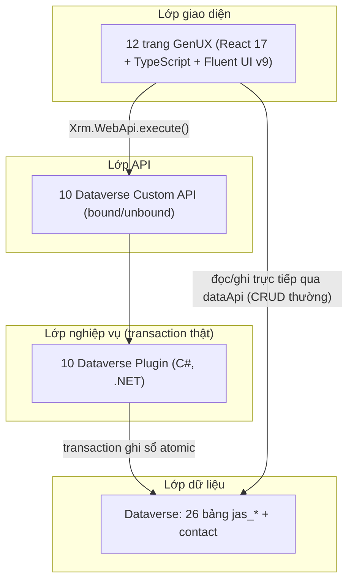
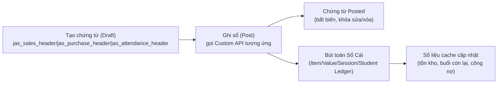
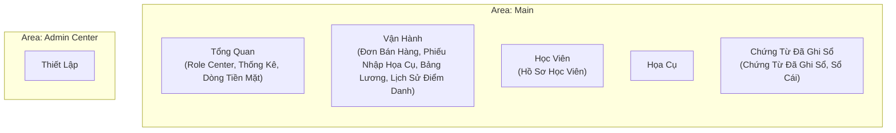

# Kiến Trúc & Thiết Kế (Design)

← [Về trang chủ](README.md)

## 1. Tổng quan kiến trúc

Hệ thống được xây dựng hoàn toàn trên **Microsoft Power Platform / Dataverse**, theo mô hình pro-code:

- **Model-driven app**: "JoiArt Studio Pro" — 1 app duy nhất, 2 khu vực điều hướng (Area): **Main** và **Admin Center**.
- **12 trang GenUX** — không dùng form/view chuẩn (native) ở bất kỳ đâu; toàn bộ giao diện là React tùy biến.
- **10 Custom API + 10 Plugin C#** cho các nghiệp vụ ghi sổ cần transaction thật (atomicity — nếu lỗi giữa chừng, toàn bộ thao tác được rollback).
- Các thao tác CRUD đơn giản (tạo/sửa học viên, danh mục...) đi thẳng qua Dataverse Web API từ trang GenUX, không qua plugin.

## 2. Mô hình dữ liệu

### 2.1. Danh mục các bảng (`jas_*` + `contact`)

| Nhóm | Bảng | Vai trò |
|---|---|---|
| Master data | `jas_class_type` | Loại lớp học |
| | `jas_course_package` | Gói học (giá, số buổi, thời hạn) |
| | `jas_shift` | Ca học |
| | `jas_item` | Họa cụ (có cache tồn kho + giá vốn) |
| | `jas_teacher` | Giáo viên |
| | `jas_app_setting` | Cấu hình chung (singleton — đúng 1 dòng) |
| Học viên | `contact` | Tái sử dụng bảng Contact chuẩn của Dataverse, thêm cột `jas_balance` (công nợ) |
| Chứng từ đang mở | `jas_sales_header` / `jas_sales_line` | Đơn bán hàng (nháp) |
| | `jas_purchase_header` / `jas_purchase_line` | Phiếu nhập hàng (nháp) |
| | `jas_attendance_header` / `jas_attendance_line` | Phiếu điểm danh (nháp) |
| | `jas_payroll_header` / `jas_payroll_line` | Bảng lương giáo viên (nháp) |
| Chứng từ đã ghi sổ | `jas_posted_sales_header` / `jas_posted_sales_line` | Đơn bán đã khóa sổ (dòng gói học = 1 lượt đăng ký) |
| | `jas_posted_purchase_header` / `jas_posted_purchase_line` | Phiếu nhập đã khóa sổ |
| | `jas_posted_payroll_header` / `jas_posted_payroll_line` | Bảng lương đã khóa sổ |
| Sổ cái (ledger) | `jas_item_ledger_entry` | Bút toán tồn kho họa cụ |
| | `jas_value_entry` | Bút toán giá trị (giá vốn/doanh thu) |
| | `jas_session_ledger_entry` | Bút toán buổi học (mua buổi / điểm danh trừ buổi / hoàn buổi khi hủy điểm danh) |
| | `jas_student_ledger_entry` | Bút toán công nợ học viên (ghi nợ/thu tiền/hoàn tiền) |
| | `jas_employee_ledger_entry` | Bút toán lương giáo viên (phát sinh/đã chi/hoàn) |
| | `jas_cash_ledger_entry` | Bút toán tiền mặt tổng hợp (thu học viên/chi lương/chi mua hàng), không gắn theo giáo viên/học viên cụ thể |

### 2.2. Quy ước chung cho bảng master data
- Cột khóa chính hiển thị (`Primary Name Attribute`) luôn là **mã tự sinh** (`jas_no`, ví dụ `GV-00001`, `SH-00001`) — được thiết lập cố định lúc tạo bảng và **không thể đổi sau khi tạo** (giới hạn nền tảng Dataverse, không có API/UI hỗ trợ).
  - Vì lý do này, mọi màn hình hiển thị **tên thân thiện** (`jas_name`) thay vì mã, đều phải tự tra cứu qua một danh sách tên đã tải sẵn ở tầng ứng dụng (xem `resolveLookupName` trong mã nguồn từng trang) — không dựa vào cơ chế hiển thị mặc định của lookup.
- Ngừng dùng/kích hoạt lại dùng cơ chế `statecode`/`statuscode` có sẵn của Dataverse — không tạo cột trạng thái riêng.

### 2.3. Vòng đời chứng từ (Document → Post → Posted + Ledger)

Cột `jas_posting_state` (`Draft`/`Posting`/`Posted`/`PostingFailed`) trên các bảng header là cờ khóa idempotency — plugin set `Posting` ngay khi bắt đầu, tận dụng row-lock của Dataverse để chặn bấm ghi sổ 2 lần liên tiếp (double-click).

**Đảo ngược ghi sổ (Reversal) — mở rộng thêm 1 nhánh của vòng đời trên**: `jas_posted_sales_header`/`jas_posted_purchase_header` có thêm cột `jas_is_reversed` (Boolean), `jas_reversed_date`, `jas_reversed_by` (lookup `systemuser`); `jas_session_ledger_entry` có thêm `jas_is_reversed` + lookup tự tham chiếu `jas_reverses_entry` (entry Reversal trỏ ngược về entry Consumption gốc) và thêm 1 giá trị Choice mới `Reversal` cho `jas_entry_type`. Nguyên tắc: **không sửa/xóa bản ghi Posted/Ledger gốc** — chỉ tạo thêm bút toán bù trừ (Reversal/Adjustment/Refund) rồi đánh dấu bản ghi gốc `jas_is_reversed = true`; với Sales Order/Purchase, chứng từ nháp gốc (`jas_sales_header`/`jas_purchase_header`) được set lại `jas_status = Open, jas_posting_state = Draft` để mở khóa sửa + ghi sổ lại (không tạo chứng từ nháp mới).

## 3. Custom API & Plugin (C#)

Mỗi nghiệp vụ ghi sổ chạy trong **1 transaction database thật** — nếu có lỗi giữa chừng, mọi thay đổi (kể cả việc set `Posting`) được rollback hoàn toàn.

| Custom API | Bound tới | Plugin | Logic chính |
|---|---|---|---|
| `jas_PostSalesOrder` | `jas_sales_header` | `PostSalesOrderPlugin` | Kiểm tồn kho mọi dòng họa cụ (kể cả cấp miễn phí) → tạo Posted Header/Lines → dòng gói học: tạo lượt đăng ký mới (remaining = số buổi gói, trạng thái Đang học) + bút toán Session Ledger (Mua buổi) → dòng họa cụ: bút toán Item/Value Ledger, trừ tồn kho → tính công nợ phải thu (không tính phần cấp miễn phí), cập nhật `jas_balance` |
| `jas_PostPurchase` | `jas_purchase_header` | `PostPurchasePlugin` | Mỗi dòng: bút toán Item/Value Ledger (nhập kho), cộng tồn kho, cập nhật giá vốn theo giá nhập gần nhất |
| `jas_PostAttendance` | `jas_attendance_header` | `PostAttendancePlugin` | Chỉ xử lý dòng có mặt; kiểm lượt đăng ký Đang học + còn buổi (hoặc buổi học thử/học nợ) + chưa trùng (mã trùng = lượt đăng ký + ngày + ca); dòng lỗi → bỏ qua dòng đó, không hủy cả phiếu; dòng hợp lệ → bút toán Session Ledger (Điểm danh, -1 buổi), trừ buổi còn lại, tự chuyển Hoàn thành nếu hết buổi (và không bật học nợ); stamp kèm ca học/giáo viên/trợ giảng lên bút toán để tra cứu sau này |
| `jas_MarkAsPaid` | `jas_posted_sales_header` | `MarkAsPaidPlugin` | Nhận số tiền thu (hỗ trợ thu từng phần, gọi nhiều lần) → bút toán Student Ledger (Thu tiền), cập nhật trạng thái thanh toán, giảm công nợ |
| `jas_ChangeLearningStatus` | `jas_posted_sales_line` | `ChangeLearningStatusPlugin` | Đổi trạng thái học (chỉ Đang học/Tạm ngưng/Đã hủy — không cho set Hoàn thành thủ công), không đụng đến số buổi còn lại |
| `jas_Reconcile` (unbound) | — | `ReconcilePlugin` | Tính lại số liệu cache (tồn kho, buổi còn lại, công nợ) từ tổng sổ cái, theo phạm vi Tất cả/Họa cụ/Học viên/Đăng ký |
| `jas_PostPayroll` | `jas_payroll_header` | `PostPayrollPlugin` | Tạo Posted Header/Lines → bút toán Employee Ledger (Payroll, theo giáo viên) → bút toán Cash Ledger (Chi/Out) → khóa bảng lương |
| `jas_CancelAttendance` | `jas_session_ledger_entry` | `CancelAttendancePlugin` | Chỉ hủy được bút toán Điểm Danh (Consumption) chưa từng bị hủy; FrontDesk chỉ hủy được entry **cùng ngày** ghi sổ, Admin hủy được mọi lúc → tạo bút toán Session Ledger Reversal (+1 buổi), cộng lại số buổi còn lại của lượt đăng ký, tự chuyển lượt đăng ký từ Hoàn thành về Đang học nếu nhờ đó lại có buổi > 0 → đánh dấu entry gốc `jas_is_reversed=true` |
| `jas_ReverseSalesOrder` | `jas_posted_sales_header` | `ReverseSalesOrderPlugin` | Admin-only. Chặn nếu có lượt đăng ký trong đơn đã bị điểm danh (remaining ≠ session_count) → dòng Họa Cụ: bút toán Item/Value Ledger điều chỉnh dương, cộng lại tồn kho → dòng Gói Học: bút toán Session Ledger Reversal, hủy lượt đăng ký (Cancelled) → bút toán Student Ledger Refund + điều chỉnh công nợ theo phần chênh billable − đã thu → đánh dấu Posted Header `jas_is_reversed=true` → mở khóa lại đơn bán gốc (`Open`/`Draft`) |
| `jas_ReversePurchase` | `jas_posted_purchase_header` | `ReversePurchasePlugin` | Admin-only. Chặn nếu tồn kho hiện tại không đủ để trừ lại (hàng đã bán bớt) → mỗi dòng: bút toán Item/Value Ledger điều chỉnh âm, trừ lại tồn kho, cập nhật lại giá vốn (last cost) theo bút toán nhập gần nhất còn lại → bút toán Cash Ledger (Thu/In) bù lại khoản chi lúc nhập hàng → đánh dấu Posted Header `jas_is_reversed=true` → mở khóa lại phiếu nhập gốc (`Open`/`Draft`) |

**Chống trùng lặp (idempotency) dù đã có transaction thật**: transaction chỉ đảm bảo 1 lần gọi là atomic, không tự chặn 2 lần gọi độc lập — vẫn cần thêm (1) cờ `jas_posting_state` + row-lock, (2) Alternate Key ở tầng DB cho bút toán điểm danh (`jas_dedup_key` trên `jas_session_ledger_entry`).

**Giới hạn nền tảng đã xác nhận qua kiểm thử thực tế**: response body của cả 6 Custom API luôn trả `OutputParameters = null` bất kể thành công hay thất bại — nguyên nhân là các plugin đăng ký ở giai đoạn PostOperation (do giai đoạn Main Operation chuẩn theo tài liệu Microsoft không thực thi được trong môi trường này). Vì vậy mọi trang GenUX gọi Custom API đều phải dựa vào **HTTP status** (200 = thành công, 4xx kèm thông điệp lỗi nghiệp vụ = thất bại) thay vì đọc nội dung phản hồi.

## 4. Các trang GenUX (12 trang)

| Trang | Tệp mã nguồn | Chức năng chính |
|---|---|---|
| Bảng Điều Khiển (Role Center) | `role-center.tsx` | KPI tổng quan, chứng từ cần xử lý, cảnh báo sắp hết buổi |
| Đơn Bán Hàng | `sales-order-card.tsx` | Tạo/sửa/ghi sổ đơn bán (khóa học + họa cụ) |
| Phiếu Nhập Họa Cụ | `purchase-card.tsx` | Tạo/sửa/ghi sổ phiếu nhập họa cụ |
| Bảng Lương | `payroll-card.tsx` | Tạo/sửa/ghi sổ bảng lương giáo viên theo kỳ (lương cứng/theo buổi/thưởng/khấu trừ) |
| Lịch Sử Điểm Danh | `attendance.tsx` | Tra cứu lịch sử điểm danh theo ngày/ca (chỉ đọc — điểm danh thật thực hiện ở Hồ Sơ Học Viên) |
| Hồ Sơ Học Viên | `student.tsx` | Quản lý học viên + popup Điểm danh + 4 tab tra cứu (công nợ, đăng ký, sổ buổi học, lịch sử mua hàng) — tab sổ buổi học có nút Hủy điểm danh trên từng dòng |
| Họa Cụ | `item.tsx` | Quản lý danh mục họa cụ, tồn kho, giá vốn/giá bán |
| Chứng Từ Đã Ghi Sổ | `posted-documents.tsx` | Tra cứu đơn bán/phiếu nhập đã khóa sổ + thao tác Thu tiền/Đổi trạng thái học/Đảo ngược ghi sổ |
| Sổ Cái | `entries.tsx` | 6 sổ cái chỉ đọc (thêm Sổ Nhân Viên, Sổ Tiền Mặt) + nút Đối Soát (chỉ Admin có quyền thực thi) + nút Hủy điểm danh trên tab Sổ Buổi Học |
| Thống Kê | `statistics.tsx` | Báo cáo doanh thu/học viên/công nợ |
| Dòng Tiền Mặt | `cash-flow.tsx` | Dashboard chỉ đọc: KPI Thu/Chi/Dòng tiền ròng tháng hiện tại, biểu đồ theo tháng, danh sách giao dịch gần đây |
| Thiết Lập | `setup.tsx` | CRUD 4 danh mục (Loại Lớp Học, Gói Học, Ca Học, Giáo Viên — có thêm 2 trường lương mặc định) + Cấu Hình chung |

### Sitemap (điều hướng)

Mỗi mục điều hướng có icon riêng phù hợp với chức năng (ví dụ: hồ sơ học viên dùng icon người, đơn bán hàng dùng icon hóa đơn, thiết lập dùng icon bánh răng).

## 5. Phân quyền

| Bảng/API | Admin | FrontDesk/Staff |
|---|---|---|
| Danh mục (loại lớp/gói học/ca học/họa cụ/giáo viên) | Toàn quyền | Chỉ đọc |
| Cấu hình chung (`jas_app_setting`) | Toàn quyền | Chỉ đọc |
| Học viên (`contact`) | Toàn quyền | Toàn quyền |
| Chứng từ đang mở (đơn bán/phiếu nhập/phiếu điểm danh/bảng lương) | Toàn quyền | Toàn quyền |
| Chứng từ đã ghi sổ (kể cả bảng lương) | Chỉ đọc | Chỉ đọc |
| Sổ cái (6 bảng `*_entry`, kể cả Sổ Nhân Viên/Sổ Tiền Mặt) | Chỉ đọc | Chỉ đọc |
| Thực thi `jas_Post*` (ghi sổ, kể cả `jas_PostPayroll`) | Có | Có |
| Thực thi `jas_MarkAsPaid`, `jas_ChangeLearningStatus` | Có | Có |
| Thực thi `jas_Reconcile` (Đối Soát) | Có | **Không** |
| Thực thi `jas_CancelAttendance` (Hủy điểm danh) | Có, **mọi thời điểm** | Có, **chỉ entry ghi sổ cùng ngày**\* |
| Thực thi `jas_ReverseSalesOrder`, `jas_ReversePurchase` (Đảo ngược ghi sổ) | Có | **Không** |

\* `jas_CancelAttendance` dùng chung 1 cổng quyền thực thi (`ExecutePrivilegeName`) cho cả 2 vai trò ở tầng Custom API — điều kiện "chỉ hủy được entry cùng ngày" của FrontDesk được plugin (`CancelAttendancePlugin`) tự kiểm tra thêm bên trong logic (so `jas_posting_date` với ngày hiện tại + xác định vai trò người gọi qua `PostingHelpers.IsCallerAdminTier`), không thể diễn đạt bằng security role tĩnh của Dataverse.

Nguyên tắc nền tảng: chứng từ Đã Ghi Sổ và Sổ Cái **không ai có quyền Tạo/Sửa trực tiếp** — chỉ có thể ghi qua Custom API tương ứng, được thực thi (enforce) thật ở tầng nền tảng Dataverse, không chỉ ẩn nút trên giao diện.

FrontDesk/Staff giữ quyền **Chỉ đọc** (không phải chặn hoàn toàn) trên Giáo Viên và Cấu hình chung vì cả hai đều được đọc trực tiếp trong các nghiệp vụ hằng ngày của FrontDesk — chọn Giáo viên phụ trách/Trợ giảng khi Điểm danh, hiển thị 2 cột này ở Lịch Sử Điểm Danh, và kiểm tra cờ "Cho phép học nợ"/gói học thử lúc điểm danh. Chỉ có **thao tác Tạo/Sửa/Xoá** (quản lý danh sách Giáo Viên, chỉnh Cấu Hình) mới giới hạn cho Admin — thực thi thật ở tầng Security Role Dataverse, không chỉ ẩn tab "Giáo Viên"/"Cấu Hình" trên giao diện Admin Center.

## 6. An toàn thao tác (confirm dialog)

Các hành động khó hoàn tác đều có bước xác nhận trước khi thực hiện:

- **Ghi sổ đơn bán / phiếu nhập**: hiển thị hộp thoại xác nhận tóm tắt số dòng/tổng tiền, kèm cảnh báo nếu phát hiện bất thường (số lượng/giá vốn bằng 0, chưa nhập nhà cung cấp, có dòng cấp miễn phí, tổng tiền bằng 0) — vì sau khi ghi sổ, chứng từ khóa và không sửa/xóa dòng được nữa.
- **Xóa dòng** trên đơn bán/phiếu nhập: luôn có hộp thoại xác nhận riêng.
- **Thu tiền / Đổi trạng thái học / Đối Soát**: đã yêu cầu nhập thông tin (số tiền, trạng thái mới, phạm vi) trong hộp thoại trước khi xác nhận — tự thân đã là một bước xác nhận.
- **Ngừng dùng** học viên/họa cụ/giáo viên/danh mục: có hộp thoại xác nhận ngắn (vì đây là thao tác có thể hoàn tác bằng cách kích hoạt lại, nên chỉ cảnh báo nhẹ, không chặn bằng chứng từ khóa).

## 6.5. Tải dữ liệu danh sách & làm mới thủ công

Hầu hết các trang danh sách/dashboard dùng chung một mẫu cache phía client: dữ liệu được lưu vào `window.__pp*Cache` (một khóa theo từng trang/query) ngay lần tải đầu tiên trong phiên trình duyệt, và các lần chuyển trang qua lại sau đó đọc thẳng từ cache thay vì gọi lại Dataverse — giúp điều hướng nhanh nhưng có thể hiển thị dữ liệu cũ nếu có thay đổi xảy ra ở nơi khác trong cùng phiên. Mỗi trang có cache kiểu này đều có kèm:
- Nút **Làm mới** (icon `ArrowClockwiseRegular`/`ArrowSyncRegular`) — xóa cache + gọi lại truy vấn.
- Nhãn thời gian tương đối bên cạnh (`useRelativeTimeLabel`, hàm dùng chung được sao chép riêng vào từng tệp theo đúng quy ước "không import chéo file" của kiến trúc này) — hiển thị "vừa xong"/"X giây trước"/"X phút trước"/"X giờ trước"/"X ngày trước", tự cập nhật mỗi 15 giây qua `setInterval`.
- Một khóa cache thời điểm tải đi kèm (ví dụ `<cacheKey>_at`) được ghi `Date.now()` cùng lúc với khóa dữ liệu, để nhãn phản ánh đúng thời điểm dữ liệu thực sự được tải, không phải thời điểm trang được mở.

## 6.6. Phân trang kiểu Business Central (lazy-load 50 dòng/lần)

Các trang danh sách nhiều dữ liệu (`student.tsx`, `item.tsx`, `entries.tsx`, `payroll-card.tsx`, `purchase-card.tsx`, `posted-documents.tsx`, `statistics.tsx`, `attendance.tsx`) không tải toàn bộ bảng cùng lúc — chỉ tải **50 dòng đầu tiên**, sau đó tự động tải thêm 50 dòng tiếp theo khi người dùng cuộn gần đến cuối danh sách (hook dùng chung `useLoadMoreOnScroll`, ngưỡng kích hoạt ~150px trước điểm cuối). Không có nút "Tải thêm" — hoàn toàn tự động qua cuộn trang (infinite scroll), có spinner nhỏ "Đang tải thêm..." trong lúc chờ. Mục tiêu: tránh tải hàng nghìn dòng cùng lúc khi số lượng chứng từ/học viên/bút toán tăng theo thời gian, giữ tốc độ mở trang nhanh.

## 7. Ghi chú kỹ thuật cho người kế thừa/mở rộng hệ thống

- Toàn bộ trang được sinh và triển khai qua `pac model genpage` (React 17 + Fluent UI v9), mã nguồn nằm ở `joiart-genux/`.
- Schema Dataverse định nghĩa dưới dạng JSON tại `dataverse/schema/`, triển khai qua các script PowerShell trong `scripts/` (`deploy-tables.ps1`, `deploy-procode-schema.ps1` cho cột/lookup thêm vào bảng đã tồn tại, `deploy-plugin-package.ps1`, `deploy-custom-apis.ps1`, `deploy-security-roles.ps1`).
- Plugin C# nằm ở `plugins/JoiArtStudio.Plugins/`.
- Chỉnh sửa sitemap (thêm/gộp nhóm điều hướng, icon) yêu cầu export solution unmanaged, sửa trực tiếp khối `<SiteMap>` trong `customizations.xml`, rồi import lại — không có API ghi trực tiếp sitemap.
- **Lưu ý khi import solution hoặc cập nhật gói plugin**: cả 2 thao tác này có thể vô tình tắt (Disable) toàn bộ 6 bước xử lý plugin (`SdkMessageProcessingStep`) — luôn kiểm tra và bật lại sau mỗi lần import/deploy plugin.
